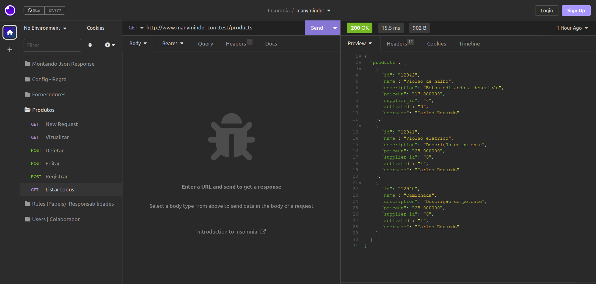
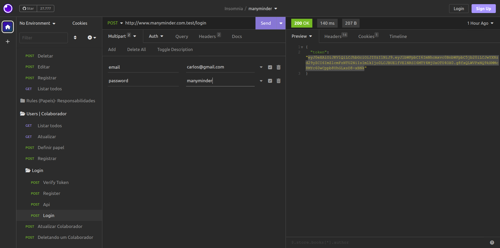
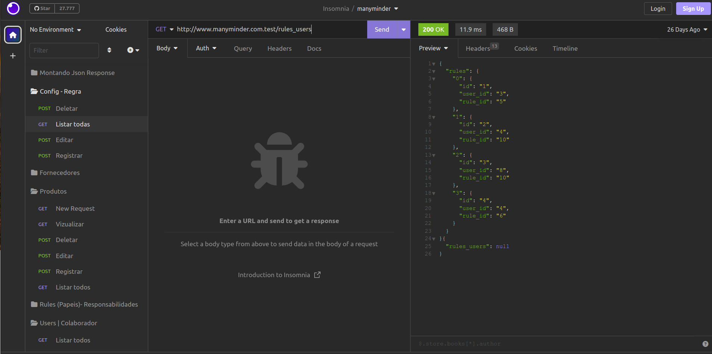

# Back para o projeto de test da Manyminds Soluções e Software.

O objetivo do projeto é criar o REST API para alimentar o front-end.

* Aqui está algumas fotos das representações em json no Insomnia

## Produtos: 

>`REST API dos produtos`

## Login: 

>`REST API Login`

## Regras:

>`REST API das regras`
